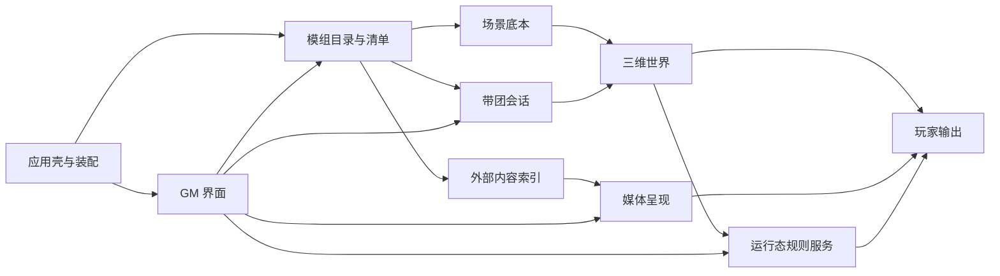

# Gvtt 后续路线图

> 状态：2026-07-21 P3 已完成并由 GM 明确接受现有证据与剩余风险；P3.2 后续完成“一份模组、多桌独立记录”和“开始”启动窗口选桌调整。本文取代此前所有 P3-P8 排法，是 P2 之后的阶段与验收真值。产品边界仍以 `docs/design.md` 为准，P2 细节仍以 `docs/p2_task_schedule.md` 为准。

## 一、先把“做完”说清楚

- P2.0-P2.6 的基础功能已经落地，但仍有一轮可见窗口验收和当前环境下的自动回归复跑。
- P3-P9 是第一版剩余路线。P9 通过后，第一版可以交付，不代表软件从此不再增加功能。
- 第一版之后只保留候选池，不提前编造 P10、P11。真实带团反馈出现后再决定是否立项。
- 阶段不是按技术名词分组，而是按依赖关系和 GM（游戏主持人）可验收结果分组。

## 二、这次为什么推翻旧路线

旧路线先讨论图片、MV（音乐视频）、气氛和特效放在哪一阶段，却没有先回答四个更基础的问题：

1. 模组清单关闭程序后能不能真实读回。
2. 模组底本、一次带团变化和临时演出分别由谁保存。
3. 场景、媒体和以后新增内容如何获得稳定标识并处理版本迁移。
4. 三维地图、图片和视频如何共用玩家输出，但不互相持有业务状态。

改版前的 `ModuleGate（模组闸门）` 打开模组时会重新创建 `ModuleManifest（模组清单）` 和 `Playthrough（带团记录）`，再从 `_canonical` 扫描场景，完整清单和带团状态尚未读回；这正是当时判定依赖倒挂的原因。P3.1/P3.2 现已完成清单与多桌带团记录读回。

## 三、系统依赖图

依赖图表达的是所有权，不是画面层级：

- `应用壳与装配` 负责创建模块、注入依赖和安排启动/清理顺序，不保存具体模组内容。
- `模组目录与清单` 是场景、媒体和演出引用的根。
- `场景底本` 是备团时编辑的原始内容。
- `带团会话` 只保存一次实际带团相对底本发生的变化。
- `玩家输出` 只决定玩家窗口此刻显示地图、图片还是视频，不拥有地图或媒体业务数据。
- `GM 界面` 发命令和显示状态，不成为第二份状态真值。

## 四、三层状态边界

| 状态层 | 保存什么 | 什么时候保存 | 不保存什么 |
|---|---|---|---|
| 模组底本 | 地点、场景、默认物件、媒体索引、气氛/特效预设与绑定 | 备团编辑保存 | 某次带团中的墙体破坏、Token 位置、播放进度 |
| 带团会话 | 当前地点、Token/墙体/光源变化、探索记忆、叙事进度 | 带团保存、退出或明确自动保存点 | 原始媒体文件、临时淡入淡出过程 |
| 临时演出 | 当前输出类型、正在播放的媒体、播放/暂停、一次性特效实例 | 通常不跨程序保存 | 模组底本和长期规则状态 |

新增功能必须先说明自己属于哪一层。不能再把同一个值同时放在 `main.gd`、控制器和界面节点里。

## 五、路线方案比较

| 方案 | 好处 | 根本问题 | 结论 |
|---|---|---|---|
| 完整框架全部先造完 | 表面上一次定型 | 没有真实消费者时只能猜接口，容易产生万能事件总线、万能加载器和空模块 | 不采用 |
| 最小可持续底座 + 工作流闭环 | 先解决所有功能共同依赖，再用真实流程逐项验证 | 每个阶段都要同时补数据、运行、界面和测试，不能只做画面 | 采用 |
| 按功能类别堆阶段 | 短期容易看到新效果 | 保存、输出、错误和清理会在每个功能里重复补洞 | 不采用 |

“框架先行”在本项目中的准确含义是：P3 先固定第一版确定需要的所有权、持久化、输出和生命周期合同；不为尚无消费者的未来功能造万能框架。P4 以后每个功能必须沿同一合同形成完整工作流。

## 六、总顺序

| 顺序 | 阶段 | 完成后得到什么 | 主要依赖 |
|---|---|---|---|
| 闸门 | P2 收口验收 | 现有地图、Token、光源、瞄准、基础 LOS（视线判定）和破墙行为有当前证据 | P0-P2 已落地 |
| P3 | 最小可持续底座 | 模组能真实重开，状态分层明确，新功能有统一装配、引用、输出和清理入口 | P2 收口 |
| P4 | 幕式内容管理与媒体演出闭环 | GM 能按幕整理图片、视频、文本和地图，并向玩家稳定手动投放，再返回地图 | P3 数据与输出合同 |
| P5 | CPR 战斗操作闭环 | GM 能从当前地点自动收集预设参战 Token，一键或手动建立先攻队列，按地形成本自动移动，并取得远程攻击的距离/DV/遮挡提示 | P2 移动与战斗线、P3 地点保存 |
| P6 | 备团与内容管理增强 | GM 能用完整媒体库、标签、批量操作和复杂场景工具高效备团 | P3-P5 的真实内容类型 |
| P7 | 高级视野闭环 | 多 Token、阵营、光暗、烟雾和探索记忆形成完整战争迷雾 | P3 状态模型、P2.5 基础 LOS |
| P8 | 完整冒险闭环 | 多地点、多楼层和一次带团的全部长期变化可以中断、重开和继续 | P6 内容管理、P7 视野状态 |
| P9 | 第一版发布闭环 | Windows 单目录便携包可在干净环境交付并完成整场模拟带团 | P3-P8 全部完成 |

## 七、开始 P3 前：P2 收口验收闸门

这不是新功能阶段，只把“历史通过记录”和“本轮当前证据”分开。

- [x] 找到可用的 Godot 4.7 执行入口后，重跑 P1、P2.4、P2.5、P2.6 四套自动回归。
- [x] GM 可见窗口确认选择、Token 移动、光源投屏同步、瞄准线、墙后暗区、破墙/修墙和保存读回；后续 `devlog/DEVLOG.md` 已记录 GM 明确“我验收了”，修正本项旧漏勾。
- [x] 记录普通切场景时间、破墙/修墙导航重建时间和双窗口帧率。
- [x] 清除 P2 当前文档中的剩余矛盾。

当前 Windows / Godot 4.7 / D3D12 / Forward+ 实测：两张现有场景切到下一可见帧约 `33-139 ms`；同步全量导航重建破墙约 `2.02 s`、修墙约 `1.81 s`；主窗口与 `1280 × 720` 投屏窗口同时显示时三轮帧率为 `42/54/43 FPS`，平均约 `46.3 FPS`。性能数据已记录，但是否满足现场体感仍属于上方 GM 可见验收，不因自动断言通过而代替。

**完成标准：** 当前四套回归无失败；GM 可见流程通过；文档只保留一个 P2 当前结论。自动回归、性能基线和文档审计已经完成，当前只剩 GM 可见操作与体感接受，不能用自动断言代替。

## 八、P3：最小可持续底座

目标：先让现有 P0-P2 和以后第一版功能都站在同一套真实数据与应用边界上。P3 不交付正式媒体库、气氛、特效、高级迷雾或楼层。

### P3.0 架构真值与装配边界

- [x] 以实际代码重画运行时应用树，标出应用壳、GM 界面、三维世界、玩家输出、运行服务和持久数据的唯一所有者。
- [x] 给 `main.gd` 的职责标注“保留协调、已经委托、待迁移”，禁止继续把新功能写进主入口。
- [x] 固定启动、开模组、切场景、切模式、开关投屏和退出的调用顺序。
- [x] 子模块用信号报告结果；应用壳注入依赖并调用命令；模块不得互相查找并修改内部节点。

### P3.1 模组清单、稳定标识与迁移

- [x] `ModuleManifest（模组清单）` 有真实磁盘文件、结构版本和读写失败结果。
- [x] 模组、地点、场景和外部内容使用稳定标识；重命名不破坏引用。
- [x] 定义缺失引用、旧版本迁移、损坏文件和备份恢复入口。
- [x] 现有 `_canonical` 场景可迁入新清单，不要求用户重新建模组。

### P3.2 最小带团会话

- [x] 明确模组底本、带团会话和临时演出三层状态。
- [x] `Playthrough（带团记录）` 有真实磁盘文件，至少保存当前地点和一项现有运行态变化。
- [x] 关闭程序再打开同一模组，点击“开始”后能够列出并进入各桌记录；“新增一桌”在同一模组下创建独立记录，不会改坏模组原始场景或其他桌。
- [x] 后续功能只能向会话增加自己的版本化数据，不另造平行存档。

### P3.3 外部内容与玩家输出合同

- [x] 定义外部内容引用，只保存稳定标识、类型、来源路径、显示名和必要元数据，不把大文件塞进存档。
- [x] 玩家输出固定 `MAP（地图）`、`IMAGE（图片）`、`VIDEO（视频）` 三类内容；它不是新的应用权限模式。
- [x] 输出合同包含进入、就绪、失败、中断、返回地图和清理；`CastView（投屏视图）` 只提供窗口承载面。
- [x] 播放后端可替换，上层不得直接依赖原生播放器或 VLC 扩展的专有接口。

### P3.4 生命周期与最小证明

- [x] 建立统一的请求、进度、完成、失败、取消和释放结果，但各内容类型保留自己的加载实现。
- [x] 建立独立测试模组，覆盖两个地点、合法/缺失/损坏/伪造/路径逃逸引用、两种窗口尺寸和一次关闭重开。
- [x] 用 Godot 自产测试图片和原生 OGV（开放视频格式）完成“地图 → 图片 → 视频 → 返回地图”的无正式媒体库冒烟链，只证明输出和清理合同。
- [x] 重跑 P1、P2.4、P2.5、P2.6、P2 验收指标和全部 P3 回归，证明结构迁移没有改变现有 GM 操作合同。
- [x] GM 已明确接受 P3.4 当前自动证据与剩余风险；本次接受不解释为“以后不会出现 bug（程序缺陷）”。

2026-07-20 P3 阶段收口证据：P3.4 无窗口 `64/64`；Windows 可见 `133/133`，真实绘制 `6275` 帧、音频峰值约 `-8.97 dB`、视频时长 `1.2333 s`；P1 `352/352`、P2.4 `56/56`、P2.5 `54/54`、P2.6 `64/64`、P2 指标 `20/20`、P3.1 `75/75`、P3.2 `39/39 + 39/39 + 32/32`、P3.3 `47/47`。这些运行均退出码为 0、0 转储、无超时、无强制清理、无残留 Godot 进程。

2026-07-21 P3.2 多桌入口调整证据：P3.1 `77/77`；P3.2 数据层 `39/39`、控制器 `39/39`、可见主界面 `62/62`；相关 GDScript 无 `:=`，旧隐藏选择器标识不存在，差异格式检查通过。复用编辑器曾输出磁盘已不存在的旧素材拖放断言，属于无效缓存运行，已直接作废，不重开 P1 完成状态；P1 最新有效独立证据仍为 2026-07-20 的 `352/352`。

**完成标准：** 模组清单和最小带团会话关闭后可读回；稳定标识、版本、缺失引用和迁移有自动测试；现有功能通过新装配边界运行；测试图片/OGV 能通过统一输出切换并彻底停止。P3 完成不代表正式图片/MV 功能已交付。

**实施技能：** `scene-organization（场景组织）`、`dependency-injection（依赖注入）`、`resource-pattern（资源模式）`、`save-load（保存与读取）`、`godot-testing（Godot 测试）`。

## 九、P4：幕式内容管理与媒体演出闭环

目标：把 P3 的最小证明变成 GM 在桌边可连续使用的内容工具；播放和地图场景能力是底层，“幕”是 GM 反复使用的第一层内容资料夹。幕可以没有地图，幕之间没有剧情顺序、完成、解锁或自动推进。

- [x] GM 可把外部图片和视频登记到当前模组，看到名称、类型和可播放状态。
- [x] 图片保持宽高比并支持淡入淡出、失败回退和返回地图。
- [x] 视频支持播放、暂停、停止、音量、结束和返回地图。
- [x] 常见格式后端已交付 Windows 小体积方案：修复后的 Native Video v0.2.1 使用 Windows Media Foundation，正式支持 MP4/MOV/M4V；VLC 仍因约 231.5 MiB 体积和导出/清理门禁失败而不采用。
- [x] 媒体使用独立音频总线；换媒体、切场景、关投屏和退出程序时停止声音并释放旧实例。
- [x] 图片演出时玩家窗口不显示 GM 控件；图片缺失或解码失败时 GM 明确看到提示，玩家窗口可靠回到地图。
- [x] 视频演出补齐同等级失败提示和安全回退。
- [x] 新增幕定义、幕内内容引用、排序、搜索和 GM 私有备注；删除幕不删除原媒体或地图。
- [x] 幕支持图片、视频、纯文本和地点/战斗地图，也允许没有地图；同一内容可跨幕复用，缺失引用保留并明确标记。
- [x] GM 可从幕内任意选择内容投放；上一项/下一项只移动选择，选择幕不改变玩家输出，不自动播放、不记录剧情完成度。
- [x] 自动回归覆盖幕清单迁移、增删改排、缺失引用、播放状态、反复使用、异常中断和清理；Windows 可见自动专项已通过。
- [x] 完整流程的客观行为已由 Godot MCP（Godot 运行态接口）与 Windows 可见专项自动验收：反复切幕、重复投放、无地图幕、按钮状态、玩家窗口隔离和错误信息隔离均通过。GM 不再重复执行这些程序可确定的检查；布局理解、拖拽手感、声音观感和真实双屏桌边效率仅作为非阻塞体验反馈。

2026-07-22 P4.5 阶段验收：修复后的 Native Video v0.2.1 已用 Windows Media Foundation 完成真实 MP4 的“地图 -> 图片 -> MV -> 暂停/恢复 -> 返回地图”、异常清理、Windows Vulkan 可见窗口、release 导出运行及 P1/P2/P3 关键回归；证据位于 `build/p45_acceptance/` 和 `devlog/DEVLOG.md`。正式支持 OGV、MP4、MOV、M4V；WebM/MKV/AVI 仍不支持。VLC 不采用。发布形态已确定为 Windows 单目录便携包：用户下载一个 ZIP，解压即用；正式运行结构为 `Gvtt.exe + 约 1.57 MiB release DLL`，严格物理单 EXE 和自定义引擎模块不再是待办。

**完成标准：** GM 可创建并反复使用任意幕，幕可有或没有地图；加入图片、视频、文本和地图后能任意选择投放，并完成“地图 → 图片 → MV → 暂停/恢复 → 返回地图”。切换幕不改变玩家输出，不产生剧情进度，无黑帧残留、重复音频或失控窗口。

**实施技能：** `godot-ui（Godot 界面）`、`audio-system（音频系统）`、`responsive-ui（响应式界面）`、`save-load（保存与读取）`、`godot-testing（Godot 测试）`。

## 十、P5：CPR 战斗操作闭环

目标：让 GM 在当前三维地点完成“备团属性/参战设置 → 自动收集 → 一键或手动先攻 → 当前角色/下一位 → 地形驱动移动 → 远程攻击提示 → 退出战斗模式”的轻量闭环。只把批量 `REF（反应）+ 1D10` 先攻作为用户批准的窄例外，不建设通用骰子或自动裁决系统。详细字段、批次、来源和验收见 [P5 CPR 战斗操作闭环规划](p5_plan.md)。

- [ ] P5.1：在现有 `CprTokenProperties` 中一次定义 INT/REF/DEX/TECH/COOL/WILL/LUCK/MOVE/BODY/EMP 十项主属性与读取接口；通用 Token 增加阵营和默认参战，当前地点自动扫描，不逐个选中。
- [ ] P5.2：让普通、困难、水、攀爬和跳跃/翻越的规则成本真正参与路线选择；点击目的地后返回最低成本合法路线及分段移动方式。
- [ ] P5.3：一键 `REF + 1D10` 与手动先攻并存；不做单 Token 重投；同值玩家优先标为 Gvtt/本团简化规则；只保留当前角色和下一位。
- [ ] P5.4：复用现有战斗线，增加目标、距离、二元遮挡和 CPR DV；通用提示合同预留其他规则集，但不实现 DND（《龙与地下城》）。
- [ ] P5.5：累计当前回合分段移动预算，提供“跑”和 GM 位置修正，最后以非破坏性的“退出战斗模式”清理临时状态。
- [ ] 活跃战斗写入版本化 `Playthrough（带团记录）`；同地点退出重开可恢复，切地点前必须明确结束并清理。
- [ ] 不自动掷先攻、攻击、闪避、伤害，不修改 HP（生命值）、SP（护甲值）、弹药或掩体耐久。

**完成标准：** GM 能用至少 3 名参战者完成 2 轮战斗操作，包含平手处理、分段移动、“跑”、ROF（开火速率）2、有/无掩体和退出恢复；自动回归、Godot MCP（运行态接口）、Windows 双窗和 GM 真人验收均有证据。

**实施技能：** `godot-ui（Godot 界面）`、`state-machine（状态机）`、`input-handling（输入处理）`、`save-load（保存与读取）`、`physics-system（物理系统）`、`godot-testing（Godot 测试）`。

## 十一、P6：备团与内容管理闭环

目标：把 P3-P5 已出现的真实内容整理成高效备团流程，而不是提前为不存在的内容造管理器。

- [ ] 场景列表补重命名、删除、复制、排序和未保存提示。
- [ ] 完整媒体库补缩略图、搜索、排序、重命名、删除和引用检查。
- [ ] 气氛、常用特效和媒体可绑定到地点/场景，形成简单演出清单，不做视频剪辑时间线。
- [ ] 增加运行时矩形/多边形色块布局工具，用于房间草图、移动、缩放、删除和随场景保存。
- [ ] 外部大文件仍位于用户内容目录；工程内置资源和 GM 外部内容保持分开。

**完成标准：** GM 能建立至少两个场景，整理一组媒体和演出提示，关闭重开后名称、顺序、引用和绑定都不丢。

**实施技能：** `godot-ui（Godot 界面）`、`2d-essentials（二维基础）`、`save-load（保存与读取）`、`assets-pipeline（素材管线）`、`godot-testing（Godot 测试）`。

## 十二、P7：高级视野闭环

目标：在单个场景内完成可用于实战的战争迷雾，再扩展跨地点长期状态。

- [ ] 定义观察者集合、阵营、共享视野、规则视距、夜视和黑暗数据。
- [ ] 多 Token 可见区域合并，并可按阵营切换玩家视图。
- [ ] 光源、环境黑暗、夜视和烟雾进入 LOS 规则；烟雾表现使用后续战术 VFX（视觉特效），规则归视野系统。
- [ ] 区分当前可见、曾经探索和从未探索，先保存单场景探索结果。
- [ ] 使用深度感知遮罩、空间索引和增量更新满足约定性能基线。

**完成标准：** 一个场景内至少四个 Token、两个阵营、光源、黑暗和烟雾同时工作；当前可见/已探索/未知显示正确，主窗口和投屏一致。

**实施技能：** `3d-essentials（三维基础）`、`shader-basics（着色器基础）`、`godot-optimization（Godot 优化）`、`save-load（保存与读取）`、`godot-testing（Godot 测试）`。

## 十三、P8：完整冒险闭环

目标：把各单场景能力串成一次可以中断、退出、重开和继续的完整带团。

- [ ] 定义楼层、显示/隐藏、相机跳转、Token 所属楼层和跨层入口。
- [ ] 扩展 P3 会话文件，保存当前地点、楼层、墙体、光源、Token、叙事进度和当前场景变化。
- [ ] 按模组、会话、地点和楼层保存长期探索记忆。
- [ ] 恢复场景绑定的气氛、媒体和常用特效清单；临时播放进度默认不恢复。
- [ ] 模组底本升级后，对旧会话执行版本检查、迁移或明确阻止，不能静默损坏。

**完成标准：** 建立至少三个地点和一个双层地点；运行中修改状态、退出程序、重新打开后，当前位置、世界变化、长期迷雾和演出引用正确恢复。

**实施技能：** `save-load（保存与读取）`、`resource-pattern（资源模式）`、`scene-organization（场景组织）`、`camera-system（相机系统）`、`godot-testing（Godot 测试）`。

## 十四、P9：第一版发布闭环

目标：不再新增大功能，只把 P3-P8 变成可交付的 Windows 第一版。

- [ ] 性能：处理破墙导航重建停顿、双窗口渲染、高级迷雾和大媒体加载。
- [ ] 稳定性：完整回归、长时间运行、反复开关投屏/切场景、异常退出和恢复。
- [ ] 数据安全：迁移、备份、损坏提示、缺失素材和用户目录权限。
- [ ] 导出：Windows 单目录便携包/ZIP、全新用户目录冒烟测试、插件许可和第三方声明。
- [ ] 体验与文档：从新建模组、备团、带团、保存、恢复到投屏完成整条验收。

**完成标准：** 干净 Windows 机器可启动发布候选；完成一场跨场景模拟带团；没有阻断流程的数据丢失、崩溃或错误恢复；所有当前文档状态一致。

**实施技能：** `export-pipeline（导出管线）`、`godot-optimization（Godot 优化）`、`godot-testing（Godot 测试）`。

## 十五、第一版之后的候选池

以下内容不自动等于 P10，必须根据真实带团反馈重新排序：

- 复杂移动规则：擒拿拖行、伤势减速和载具；基础行动记账已前移到 P5。
- CPR 风格三维演出：枪口火光、爆炸、烟雾、电击、医疗演出和场景气氛；不以火球/治疗法术为核心。
- 规则辅助扩展：技能快捷入口和更多状态提示；不自动掷骰或结算伤害。
- 三维媒体屏幕：把视频贴在地图内电视、广告牌或墙面，而不是全屏玩家输出。
- 联网、玩家端、账号、模组市场仍在当前产品边界之外。

## 十六、四层依据与取舍

### 项目现状

- `scripts/main.gd` 为 4107 行、217 个函数；已有 R1-R5 控制器，但主入口仍执行大量具体业务。
- `scripts/module_gate.gd::_open_module_state()` 每次打开模组重新创建清单和带团对象，完整持久化尚未形成。
- `scripts/cast_view.gd` 使用独立 `Window` 直接共享主窗口 `World3D`；只有迷雾遮罩内部使用子视口。
- 现有 P1、P2.4、P2.5、P2.6 自动测试覆盖当前功能，但没有覆盖模组清单重开、带团恢复、稳定标识和媒体引用。

### Godot 4.7 源码

- 精确基线：`4.7-stable`，提交 `5b4e0cb0fd279832bbdd69fed5354d4e5ad26f88`。
- `main/main.cpp::Main::start()`：自动加载先建立并挂入，再进入主场景。
- `scene/main/node.cpp::_propagate_enter_tree()`、`_propagate_ready()`、`_propagate_exit_tree()`：节点启动与清理顺序。
- `core/io/resource_loader.cpp::_load_start()` 与 `core/io/resource_saver.cpp::save()`：资源加载、缓存和保存。
- `scene/resources/packed_scene.cpp::SceneState::instantiate()`：节点实例化，与资源数据层分开。
- `scene/main/viewport.cpp::find_world_3d()/set_world_3d()`：窗口/视口的世界绑定。
- `scene/gui/video_stream_player.cpp::set_stream()/play()/stop()` 与 `scene/resources/video_stream.cpp::instantiate_playback()`：播放器生命周期与解码后端分离。

### 官方资料

- `Scene organization（场景组织）`：场景尽量自包含，高层父节点负责装配和依赖注入。
- `Autoloads versus regular nodes（自动加载与普通节点）`：只把真正跨场景且独立的少量服务放入自动加载。
- `Resources（资源）`、`PackedScene（打包场景）`：数据容器与节点实例分工。
- `Runtime file loading and saving（运行时文件加载与保存）`：用户外部内容与工程内置资源使用不同路径。
- `Playing videos（播放视频）`：Godot 核心只原生支持 Ogg Theora；常见格式需要扩展或转码。
- `Using Viewports（使用视口）`：窗口/视口负责显示和世界绑定，不承担模组数据所有权。

### 英文社区与开源

- Tabletop Club 素材包规范：<https://docs.tabletopclub.net/en/stable/custom_assets/asset_packs/asset_pack_structure.html>。借鉴外部内容按包和类型组织、保存文件与内容分开；不照搬其 Godot 3.x、多人与物理沙盒架构。
- Godot 架构组织建议：<https://github.com/abmarnie/godot-architecture-organization-advice>。采用自包含场景、父级注入和避免过早抽象的原则，不视为强制框架。
- Godot VLC 1.2.0：<https://godotengine.org/asset-library/asset/3766>。仅作为 P4 的常见格式解码候选；它不解决模组、会话、媒体库和输出路由。
- 没有找到可直接承担 Gvtt 完整“模组底本 + 带团会话 + 外部内容 + 玩家输出”的成熟插件，因此这些仍是本项目核心实现。
